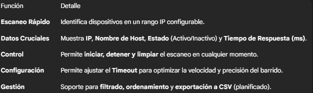
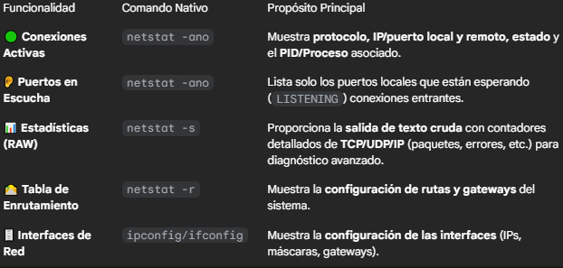

# Proyecto RedScanner

Estructura del Proyecto
---

## Estado del proyecto

- En el **primer plazo** realicé lo básico y necesario para que el programa funcione correctamente.
- Al subirlo a GitHub, las carpetas no se organizaron bien.
- En el **segundo plazo** hice limpieza y reestructuración de las carpetas para mejorar el orden y la claridad del proyecto.
- Tercer plazo del nuevo avance el cual se trata de la implementacion de netstat !
- Ultimo plazo de la implementacion de netstat, tuve inconvenientes con la implementacion por lo cual tuve que hacer un cambio RADICAL del ordenamiento de carpetas, ya que cuanto mas codigo habia, mas orden tenia que tener, y tuve que usar MCV, el cual no estaba usando anteriormente.. usaba app modelos, que no era lo suficientemente eficiente a la larga

---

## Descripción
RedScanner es una potente herramienta desarrollada en Java Swing para el monitoreo y análisis detallado de redes locales. Combina un escáner de red (Ping Sweep) con un visor avanzado de utilidades de sistema (NetStat), ofreciendo a administradores y técnicos una solución de diagnóstico completa y en tiempo real.

El objetivo principal es proporcionar visibilidad completa de los dispositivos conectados, facilitando la detección de anomalías y la mejora de la seguridad.

---

### Funcionalidades Pricipales
## El proyecto se divide en dos módulos clave dentro de la interfaz gráfica

1. Módulo de Escaneo de Red (RedScanner)

2. Módulo de Análisis de Red (NetStat Viewer)
Este módulo implementa una interfaz gráfica para las funciones clave de netstat obteniendo los datos directamente del sistema operativo

---

## Gestion de Resultados
- Filtrado: Todos/Activos/Inactivos
- Ordenamiento: Click en columnas para ordenar
- Exportación: Guardar resultados en CSV
- Búsqueda: Escaneo individual por IP

---

## Objetivo
- Visibilidad completa de los dispositivos en la red local.  
- Detectar conflictos de configuración o dispositivos no autorizados.  
- Facilitar el control y la seguridad de la red.

---

## Requerimientos
- Java JDK 11 o superior  
- IDE recomendado: Eclipse o IntelliJ IDEA  
- Sistema operativo: Windows, Linux o macOS  
- Librerías estándar de Java (sin dependencias externas)

---

##  Instrucciones de Uso

### 1. Configuración Inicial
🔗 [Documentación del Proyecto](https://1drv.ms/w/c/cf55db22f6cdb784/EZgcJ4a4esVGhZRO5Zep-ikBJ-1Huc5oyqUuKGPG1HIRiw?e=WQcOAp)

### 2. Clonar el Repositorio
1. **Como?**: git clone https://github.com/TU_USUARIO/NOMBRE_DEL_REPOSITORIO.git"  
2. **Abrir en IDE**:  Importa el proyecto como un Proyecto Java existente  
3. **Ejecutar**: Localiza y ejecuta la clase principal (la que contiene el método main)  

### 3. Configuración Básica
1. **Preparación**: Iniciar entorno de desarrollo  
2. **Optimización**: Ajustar parámetros de actividad  
3. **Validación**: Confirmar configuración  
4. **Configurar Escaneo**:  En la ventana principal, introduce las IPs de inicio/fin y ajusta el Timeout (ms)
5. **Diagnóstico**: Utiliza el botón "Abrir NetStat" para acceder a las herramientas de análisis de protocolo y conexiones

---
